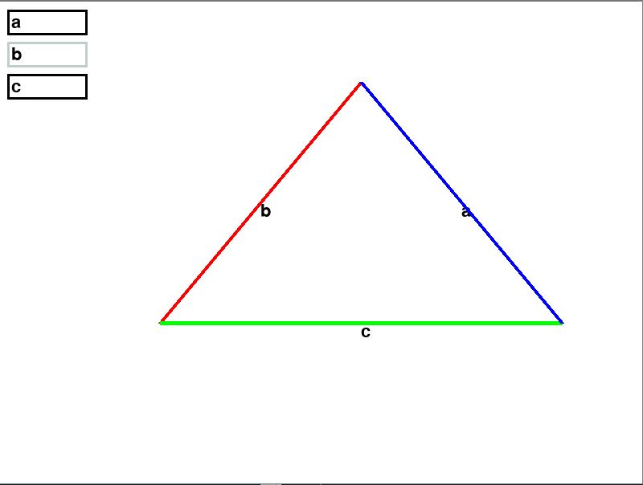

# Triangle Calculator with Pygame

This Python project uses the Pygame library to create a simple graphical application that allows users to interactively enter the lengths of the sides of a triangle. The program will visually display the triangle, its sides labeled, and print the lengths of the sides in the console.

## How to run 
- download the main.exe file
- run the file

